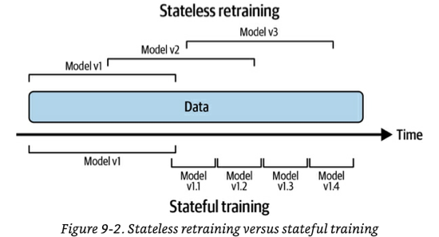
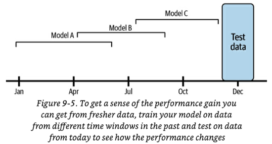
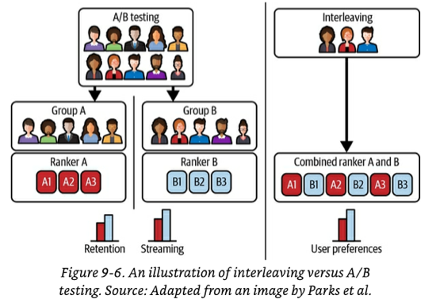
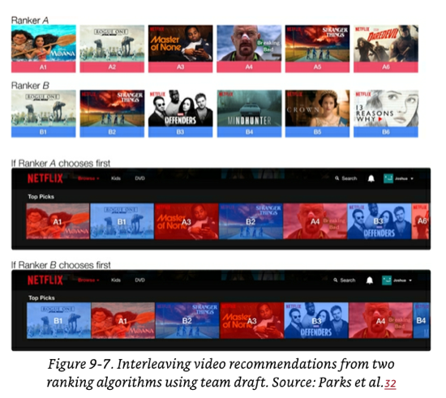

# CHAPTER 2: CONTINUAL LEARNING AND TEST IN PRODUCTION
This section addresses two significant and interconnected subjects: Continual Learning and Testing models in Production. The objective of exploring these topics concurrently is to acquire the skills needed to automate, ensure safety, and enhance the efficiency of updating models in a production setting.

## 2.1 Continual Learning
Continual Learning involves the concept of regularly updating your model as new data becomes accessible, allowing it to stay aligned with current data distributions.

However, once the model undergoes an update, it is not advisable to deploy it to production without thorough testing. It is crucial to conduct testing to verify the safety and superiority of the updated model compared to the existing one in production. This is the focus of the subsequent section, titled "Testing models in Production".

Continual learning is frequently misunderstood:
- Continual learning does NOT exclusively pertain to a specific category of ML algorithms designed for incremental model updates with each new datapoint, such as sequential Bayesian updating and KNN classifiers. These algorithms, often termed "online learning algorithms," represent a limited subset.
  - The concept of Continual learning is applicable to any supervised ML algorithm, not confined to a particular class.
- Continual learning does NOT involve initiating a retraining process every time a new data sample becomes available. In fact, this practice is risky, as it can render neural networks susceptible to catastrophic forgetting.
  - Many companies that implement continual learning update their models in micro-batches, typically at intervals like every 512 or 1024 examples. The optimal number of examples varies depending on the specific task.
  
While Continual learning may initially appear to be a task for data scientists, it frequently demands substantial **infrastructure work** to be effectively implemented.

### 2.1.1 Why Continual Learning?
The fundamental purpose is to assist your model in **staying aligned with shifts in data distribution**. Several critical use cases underscore the need for swift adaptation to changing distributions, including:
- **Use Cases with Unpredictable and Rapid Changes**: Industries like ride-sharing face scenarios where unexpected and rapid changes occur. For instance, a concert in an unforeseen location on a random Monday could challenge the effectiveness of the "Monday pricing ML model".
- **Use Cases Lacking Training Data for Specific Events**: Certain situations, such as Black Friday or novel sale events in e-commerce, pose challenges in acquiring sufficient historical data for training. Adapting the model throughout the event becomes essential to predict user behavior.
- **Use Cases Prone to the Cold Start Problem**: The cold start problem arises when a model needs to make predictions for a new or logged-out user without any historical or outdated data. Adapting the model promptly upon receiving data from such users is crucial for providing relevant recommendations.

### 2.1.2 Concept: Stateless retraining VS Stateful training

#### 2.1.2.1 Stateless retraining
Initiate a complete retraining of your model on every occasion, utilizing freshly initialized weights and updated data.
- There could be instances of data overlap with what was previously used to train the prior version of the model.
- Many companies commence continual learning through a stateless retraining approach.

#### 2.1.2.2 Stateful training (aka fine-tuning, incremental learning)
Initialize your model with weights from the previous training round and proceed with training on new, unseen data.
- This approach enables the model to update with considerably less data.
- Convergence is faster, and less compute power is required, with some companies reporting a 45% reduction.
- Theoretically, it may eliminate the need to store data once it's been used for training, addressing privacy concerns.
  - However, in practice, many companies tend to retain data even when unnecessary.
- Periodic **stateless retraining** with a large dataset is necessary to recalibrate the model.
- Once the infrastructure is properly configured, switching from stateless retraining to stateful training is a simple process.
- **Model iteration versus data iteration**: Stateful training is mainly employed to integrate new data **into an existing fixed model architecture** (i.e., data iteration). If you want to modify your model's features or architecture, a preliminary stateless retraining is required.
  - Some research exists on techniques like Net2Net knowledge transfer and model surgery for transferring weights between different model architectures. However, these methods have seen little to no adoption in industry so far.

### 2.1.3 Concept: feature reuse through log and wait
Features are computed for inference, and certain companies opt to store these calculated features for each data sample. This practice, known as **log and wait**, allows for the reuse of features in continual learning training, leading to computational savings. Additionally, it serves the purpose of aiding feature monitoring. While not widely adopted as of January 2023, log and wait is gradually gaining popularity.

### 2.1.4 Continual Learning Challenges
Despite its successful application in the industry, continual learning poses three significant challenges that companies must address.
#### 2.1.4.1 Fresh data access challenge
To update your model every hour, obtaining **high-quality labeled** training data on an hourly basis is essential. The more frequent the update schedule, the more crucial this challenge becomes.

**Problem: Speed of data deposit into data warehouses**

Numerous companies retrieve their training data from data warehouses such as Snowflake or BigQuery. However, data from various sources is fed into the warehouse through distinct mechanisms and at varying rates.

For instance, data in the warehouse may come directly from real-time transport (events), while other portions may be sourced from daily or weekly ETLs that transfer data from other origins.

A common solution to address this challenge involves extracting data directly from real-time transport for training before it gets deposited in the warehouse. This approach is particularly effective when the real-time transport is linked to a feature store. However, there are hurdles to implementing this strategy:
- Some data, especially from external vendor systems beyond your control, may not flow through events. To ensure freshness in such cases, finding a method to capture changes on those systems using events, web-hooks, or polling APIs becomes necessary.
- In certain companies, batched ETLs perform extensive processing and data joining within the data warehouse to enhance utility. Shifting to a full real-time transport strategy requires devising a way to replicate the same processing on a continuous stream of data.

**Problem: Speed of labelling**

The rate at which new data can be labeled often serves as a bottleneck. Tasks with inherent labels and short feedback loops are the most suitable for continual learning, as a **shorter feedback loop** allows for faster labeling.

If obtaining natural labels within the required timeframe is challenging, alternative approaches such as weak supervision or semi-supervision techniques can be considered, albeit with the trade-off of potentially noisier labels. As a last resort, recurrent and rapid crowdsourcing for label annotation may be an option.

Another factor influencing labeling speed is the **label computation strategy**:
- Batch label computation involves periodic processing of data deposited into the data warehouse. The labeling speed is dependent on both the speed of data deposition and the frequency of label computation jobs.
- Similar to the aforementioned solution, a common method to expedite labeling is to compute labels directly from real-time transport (events). However, this streaming computation comes with its own set of challenges.

#### 2.1.4.2 Evaluation Challenge
Incorporating continual learning as a practice introduces the risk of significant model failures. The higher the frequency of model updates, the greater the chances of encountering failures.

Furthermore, continual learning creates opportunities for coordinated adversarial attacks aimed at poisoning the models.

Consequently, rigorous testing of models before their deployment to a broader audience becomes crucial.
- Testing is a time-consuming process, serving as a potential constraint on achieving the fastest model update frequency.
- For instance, a new model designed for fraud detection may require approximately two weeks to accumulate sufficient traffic for a confident evaluation.

#### 2.1.4.3 Data scaling challenge
Feature calculation typically involves scaling, which, in turn, necessitates access to global data statistics such as minimum, maximum, average, and variance.

In the case of stateful training, global statistics must account for both the previous data used to train the model and the new data being employed for updates. Managing global statistics in this context can be challenging.

A common approach to address this challenge is to calculate or approximate these statistics incrementally as new data is observed, as opposed to loading the entire dataset at training time for computation.
- An illustrative example of this technique is "Optimal Quantile Approximation in Streams".
- Sklearn’s StandardScaler offers a *partial_fit* method that enables a feature scaler to be used with running statistics. However, the built-in methods are slow and have limitations in supporting a broad range of running statistics.

#### 2.1.4.4 Algorithm challenge
This issue arises when certain types of algorithms are employed and there is a need for rapid updates, such as every hour.

The algorithms in question are those that, by design, depend on having access to the complete dataset for training. Examples include matrix-based, dimensionality reduction-based, and tree-based models. Unlike neural networks or other weight-based models that can be incrementally trained with new data, these types of models require the entire dataset.
- For instance, PCA dimensionality reduction cannot be performed incrementally; the full dataset is necessary.

This challenge becomes particularly pronounced when there is a need for very fast updates, and waiting for the algorithm to process the full dataset is not feasible.

While there are some variations of these models designed for incremental training, their adoption is not widespread. Hoeffding Trees and sub-variants are examples of such algorithms.

### 2.1.5 The Four Stages of Continual Learning
Typically, companies progress through four stages when transitioning to continual learning.

#### 2.1.5.1 Stage 1: Manual, stateless retraining
Retraining of models occurs only under two conditions: (1) when the model's performance has significantly deteriorated, reaching a point where it becomes counterproductive, and (2) when the team has the available time and resources to carry out the update.

#### 2.1.5.2 Stage 2: Fixed schedule automated stateless retraining
This stage typically occurs when the primary models in a domain have already been established, shifting the focus from creating new models to maintaining and enhancing existing ones. Remaining in stage 1 becomes too burdensome to overlook.

During this stage, the retraining frequency is often determined by intuition or a "gut feeling".

The transition from stage 1 to stage 2 is commonly marked by the development of a script that someone creates to execute stateless retraining at regular intervals. Writing this script's complexity varies based on the number of dependencies that need coordination for model retraining.

The fundamental steps of this script include:
1. Retrieve data.
2. Perform downsampling or upsampling if required.
3. Extract features.
4. Process and/or annotate labels to generate training data.
5. Initiate the training process.
6. Assess the new model.
7. Deploy the updated model.
   
To implement this script, two additional components of infrastructure are necessary:
1. A scheduler.
2. A model store to automatically version and store all the artifacts required to reproduce the model. Established model stores include AWS SageMaker and Databrick's MLFlow.

#### 2.1.5.3 Stage 3: Fixed schedule automated stateful training
To accomplish this, you must modify your script and establish a method for tracking data and model lineage. A straightforward model lineage versioning example includes:
- V1 vs V2, representing two distinct model architectures addressing the same problem.
- V1.2 vs V2.3 signifies that model architecture V1 is in its second iteration of a full stateless retraining, while V2 is in its third.
- V1.2.12 vs V2.3.43 indicates that there have been 12 stateful trainings performed on V1.2 and 43 on V2.3.
- It's likely that you'll need to combine this approach with other versioning techniques, such as data versioning, to maintain a comprehensive understanding of how the models are evolving.
- The author notes that there is no known model store with this type of model lineage capability, prompting companies to develop their own in-house solutions.
- At any given point, multiple models will be operational in production concurrently, facilitated by the arrangements outlined in Testing Models in Production.

#### 2.1.5.4 Stage 4: Continual learning
In this stage, the **fixed schedule** component from previous stages is replaced by a **retraining trigger mechanism**. The triggers can be:
- **Time-based**.
- **Performance-based**, where retraining is triggered if performance falls below a certain threshold (e.g., below x% accuracy). However, measuring accuracy directly in production may not always be feasible, requiring the use of a weaker proxy.
- **Volume-based**, where retraining is prompted by a 5% increase in the total amount of labeled data.
- **Drift-based**, where retraining is initiated when a “major” shift in data distribution is detected. The challenge with drift-based triggers, as mentioned in the preceding chapter, is determining when such data distribution shifts become problematic for the model's performance degradation.

### 2.1.6 How often to Update your models
To address this question, you must initially comprehend and assess **the benefits derived from updating your model with fresh data**. The frequency of retraining should be proportionate to the extent of the gain achieved with each update.

#### 2.1.6.1 Measuring the value of data freshness
An approach to measure the significance of fresher data is to train the same model architecture using data from three distinct time periods and subsequently evaluate each model with current labeled data (refer to the image below).

If the analysis reveals that allowing the model to stagnate for three months results in a 10% deviation in accuracy on current test data, and if a 10% deviation is deemed unacceptable, then the conclusion is that retraining should occur more frequently than every three months.

The illustration provides examples using multi-month datasets, but your specific use case might necessitate more detailed time buckets, such as weeks, days, or even hours.

#### 2.1.6.2 When should I do model iteration?
Up to this point in the chapter, the focus has mainly been on updating your model with new data (i.e., data iteration). However, in practical scenarios, there may be instances where you need to modify the architecture of your model over time (i.e., model iteration). Here are some guidelines on when to consider model iteration and when to refrain:
- If consistently reducing the data iteration retraining trigger doesn't yield significant gains, it might be worthwhile to explore a better model (assuming it aligns with your business needs).
- In cases where transitioning to a larger model architecture requiring 100X compute power results in a marginal 1% performance improvement, while reducing the retraining trigger to 3 hours with 1X compute power also provides a 1% performance increase, prioritize data iteration over model iteration.
- The question of “when to do model iteration vs. data iteration” lacks a universally applicable answer across all tasks. Experimentation specific to your task is necessary to determine the optimal approach in each case.

## 2.2 Testing models in Production
To thoroughly assess your models before their broad deployment, a comprehensive strategy involves both **pre-deployment offline** evaluations and **testing in production** environment. Relying solely on offline evaluations is inadequate.

It is preferable for each team to establish a transparent pipeline outlining how models undergo evaluation. This includes specifying the tests to be conducted, designating responsible individuals, and establishing thresholds for promoting a model to the next stage. Automation of these evaluation pipelines, initiated with each new model update, is optimal. Similar to the evaluation of Continuous Integration/Continuous Deployment (CI/CD) in software engineering, reviews should be conducted for stage promotions.

### 2.2.1 Pre-deployment offline evaluations
The two most common methods are (1) using a **test split** for comparison against a baseline and (2) conducting **backtests**.
- **Test splits** are typically **static**, serving as a reliable benchmark for comparing multiple models. However, good performance on a static and older test split doesn't guarantee similar performance under the current data distribution conditions in production.
- **Backtesting** involves using the latest labeled data **that the model hasn't encountered during training** to assess performance (e.g., using data from the last hour if trained on data from the last day).
  - This summary introduces **backtests** for the first time.
  - While it might be tempting to rely solely on backtesting to avoid testing in production, it is not sufficient. Production performance involves more than just label-related metrics. Factors like latency, user behavior with the model, and system integration correctness must be observed to ensure the model's safety for widespread deployment.

### 2.2.2 Testing in Production Strategies
#### 2.2.2.1 Shadow Deployment
**Intuition**: Simultaneously deploy the new challenger model alongside the existing champion model. Route all incoming requests to both models, but serve only the predictions from the champion model. Record predictions from both models for subsequent comparison.

**Pros**:
- This method ensures the safest model deployment, as even if the new model has bugs, its predictions won't be served.
- It is a straightforward concept.
- This approach quickly accumulates enough data for statistically significant results since all models receive full traffic.
  
**Cons**:
- Not applicable when assessing model performance requires observing user interactions with predictions. For instance, predictions from shadow recommender models won't be served, making it impossible to determine if users would have clicked on them.
- It is cost-intensive as it doubles the number of predictions and, consequently, the required computing resources.
- If inference occurs using any online prediction modes, addressing edge cases such as variations in serving time or potential failure of the shadow model becomes necessary. For instance, determining the response if the shadow model takes much longer than the primary model or if the shadow model fails.

#### 2.2.2.2 A/B Testing
**Intuition**: Deploy the new challenger model alongside the existing champion model (model A) and direct a percentage of traffic to the challenger (model B). Present predictions from the challenger to users. Use monitoring and prediction analysis on both models to determine if the challenger's performance is statistically superior to the champion.
- For some use cases where dividing traffic is challenging, temporal splits can be employed, alternating between model A and model B on different days.
- The traffic split **must be a truly randomized experiment** to avoid selection bias, ensuring unbiased conclusions. For example, assigning model A to desktop users and model B to mobile users would introduce bias.
- The experiment duration should be sufficient to accumulate an adequate number of samples for statistically significant results.
- While statistical significance is not foolproof, if there is no discernible difference between A and B, either model can likely be used.
- Running A/B/C/D tests or more is feasible if desired.
  
**Pros**:
- Since predictions are served to users, this technique enables a comprehensive understanding of user reactions to different models.
- A/B testing is straightforward to comprehend, with ample libraries and documentation available.
- It is cost-effective as there is only one prediction per request.
- Edge cases arising from parallelizing inference requests in online prediction modes, as seen in shadow deployments, are avoided.
  
**Cons**:
- It is less secure than shadow deployments, as real traffic is exposed to the new model, requiring a stronger offline evaluation guarantee to prevent potential failures.
- A balance must be struck between assuming more risk (routing more traffic to the B model) and obtaining enough samples for a faster analysis.
  
#### 2.2.2.3 Canary Release
**Intuition**: Deploy the challenger and champion models side by side, initially with the challenger receiving no traffic. Gradually transfer traffic from the champion to the challenger (the canary). Monitor the performance metrics of the challenger, and if they meet expectations, continue until all traffic is directed to the challenger.
- Canary releases can be combined with A/B testing for thorough performance measurement.
- Alternatively, canary releases can operate in “YOLO mode”, where performance differences are visually assessed.
- Another version of a canary release involves introducing the challenger model to a smaller market first and then expanding to all markets if successful.
- If issues arise with the challenger model, traffic can be redirected to the champion.
  
**Pros**:
- Easy to understand.
- Simple to implement, especially if there is existing feature flagging infrastructure in the company.
- Since predictions from the challenger are served, this approach is suitable for models requiring user interaction to assess performance.
- Compared to shadow deployments, it is cost-effective, involving only one inference per request.
- When paired with A/B testing, it enables dynamic adjustment of the traffic distribution between models.
  
**Cons**:
- Possibility of being less rigorous in determining performance differences.
- If releases are not closely supervised, accidents can occur. While arguably less secure, it offers a straightforward rollback option.

#### 2.2.2.4 Interleaving Experiments
**Intuition**: In A/B testing, a single user receives predictions exclusively from either model A or model B. In interleaving, a single user is provided with interleaved predictions from both model A and model B. User preferences for each model are measured, such as tracking which recommendations lead to more user clicks.
- Interleaving is commonly employed in recommendation tasks, but not all tasks are well-suited for this strategy.
- To prevent unfair user preference advantages, such as always favoring the top prediction from model A, equal likelihood should be ensured for the first slot to come from either model A or model B. The **team-drafting method** can be used for filling the remaining positions (refer to the image below).

**Pros**:
- Experimental findings from Netflix suggest that interleaving reliably identifies the best model with a **considerably smaller sample size** compared to traditional A/B testing, mainly because both models receive full traffic.
- Unlike shadow deployments, this strategy allows observation of user behavior against predictions since predictions are served.
  
**Cons**:
- Implementation is more complex than A/B testing.
  - Concerns about edge cases arise, such as determining the course of action if one of the interleaved models takes too long to respond or fails.
- It doubles the required compute power because each request receives predictions from multiple models.
- Not suitable for all types of tasks; for instance, it works well for ranking or recommendation tasks but may not make sense for regression tasks.
- Scaling to a large number of challenger models is challenging; the sweet spot seems to be 2-3 interleaved models.

#### 2.2.2.5 Bandits
**Intuition**: Bandits are algorithms that assess the current performance of each model variant and dynamically decide, for each request, whether to exploit the current best-performing model (i.e., exploit current knowledge) or to explore other models to gather more information about them (i.e., explore to identify potentially better models).
- Bandits introduce the concept of *opportunity cost* to the decision-making process.
- Applicability of bandits depends on specific conditions. For bandits to be relevant, the use case must involve online predictions, as batched offline predictions are not compatible. Additionally, short feedback loops are required to determine prediction quality swiftly and a mechanism to propagate feedback into the bandit algorithm for updating each model's payoff.
- Numerous bandit algorithms exist, with *epsilon-greedy* being the simplest, and *Thompson Sampling and Upper Confidence Bound (UCB)* being among the most powerful and popular.
  
**Pros**:
- Bandits require significantly less data than A/B testing to determine the superior model. For instance, a book example cites 630K samples for 95% confidence in A/B testing compared to 12K with bandits.
- Bandits are more data-efficient while simultaneously minimizing **opportunity cost**, making them optimal in many cases.
- In comparison to A/B testing, bandits are considered safer because they select poorly performing models less frequently. Convergence is faster, allowing swift elimination of inferior challengers.
  
**Cons**:
- Implementation of bandits is more challenging compared to other strategies due to the continuous need to propagate feedback into the algorithm.
- Applicability is limited to specific use cases (as outlined above).
- Bandits are not as secure as Shadow Deployments, as challengers receive live traffic.
